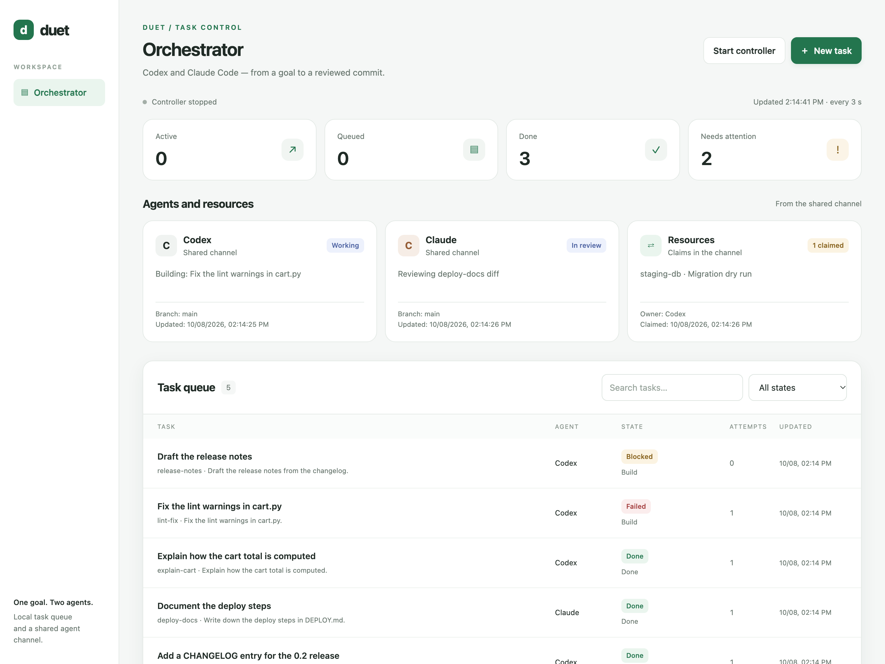
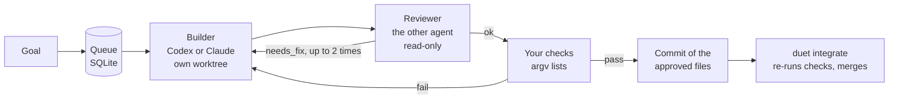

# duet

[](https://github.com/yartsun/agent-duet/actions/workflows/ci.yml)


Run **Codex** and **Claude Code** as a pair: one agent builds, the other reviews, and nothing lands in your
branch until the review passes and your own checks are green.



duet is a local orchestrator for coding agents. You describe a goal. duet hands it to one agent in an isolated
git worktree, gives the real diff to the other agent for a read-only review, runs the checks you specified and
commits exactly the files that were approved. A local dashboard shows the queue, attempts, token usage and logs.

## Why

- **Two models catch each other's mistakes.** The reviewer sees the actual diff and file list, not just the
  builder's summary, and can send the task back with concrete remarks.
- **Your working copy stays untouched.** Every task gets its own worktree and branch.
- **Side effects stay with you.** Agents can only ask for an action (`needs_user`); nothing from their answers is
  ever executed.

## How it works



Tasks can depend on each other (`depends_on`), build on another task's commit (`base_task`), be read-only
analyses, or carry images pasted into the dashboard.

## Guard rails

| Risk | What duet does |
|---|---|
| Agent edits outside the task | Changes outside `allowed_paths`, secret files (`.env`, `*.pem`, `*.key`, SSH keys) and changed symlinks stop the task |
| Reviewer quietly "fixes" code | The worktree is fingerprinted (SHA-256 and mode) before review; any change rejects the review |
| Unreviewed content gets committed | The commit is built in a fresh git index from the approved files only; if a check (say, a formatter) changes files, the task goes back for another review |
| Command injection | Checks are argument lists from your task spec, never shell strings and never taken from agent output |
| Crash mid-run | Launch and commit intents are written before acting; a restarted controller resumes without launching an agent twice, and an unconfirmed process exit blocks retries |
| Runaway spend | An optional per-task token budget covers the builder, the reviewer and retries, and a session that reports no usage blocks the next launch; every Claude session also gets `--max-budget-usd` |
| Over-powered CLIs | Codex runs with approvals off, network and web search disabled and a read-only sandbox for review; Claude gets an explicit tool allowlist without Bash and `dontAsk` permissions |
| Dashboard abuse | Binds to 127.0.0.1, checks Host, Origin and a custom header against DNS rebinding and CSRF, redacts tokens and keys in logs |

## Try it without any agents

```bash
git clone https://github.com/yartsun/agent-duet && cd agent-duet
python3 examples/demo.py --serve
```

The demo creates a throwaway repository, puts stand-in `codex` and `claude` scripts on `PATH` and runs five
tasks through the full cycle: three finish with commits, one fails its check and one is blocked by it. Then it
opens the dashboard at http://127.0.0.1:18789/. Nothing is installed and no model is called.

## Use it on your repository

You need macOS or Linux, Python 3.10+, git 2.31+ and the `codex` and `claude` CLIs on `PATH`, signed in.
Real runs spend your Codex and Claude quota.

```bash
uv tool install git+https://github.com/yartsun/agent-duet     # or: pipx install git+https://...
cd your-repo
duet submit "Reject malformed emails in the signup form and add tests" --allow 'src/signup/**' --allow 'tests/**'
duet run                     # build → review → checks → commit, then exit
duet status
duet integrate <task-id>     # merge into develop after re-running the checks (--into BRANCH)
duet-web                     # dashboard at http://127.0.0.1:18789/
```

For full control, describe the task in JSON and add it with `duet enqueue --file task.json`:

```json
{
  "id": "signup-validation",
  "title": "Validate the signup form",
  "prompt": "Reject empty and malformed emails in the signup form and cover it with tests.",
  "agent": "codex",
  "reviewer": "claude",
  "allowed_paths": ["src/signup/**", "tests/test_signup.py"],
  "checks": [["npm", "test", "--", "signup"]],
  "max_fixes": 2,
  "timeout_seconds": 900,
  "token_budget": 200000
}
```

Every prompt includes your project rules from `AGENTS.md` (change with `--context FILE`) and the shared
`CONTEXT.md` of the channel, truncated to `context_chars` while the goal itself is always kept whole.

## Coordinating interactive sessions

When you work with Codex and Claude interactively in two worktrees, `duet-coord` gives them a shared channel:

```bash
duet-coord status  --agent claude --state working --task "Speed up the build"
duet-coord send    --agent claude --to codex --body "Build is green, your turn"
duet-coord claim   --agent codex --resource staging-db --task "Migration dry run"
duet-coord wait    --agent codex          # blocks until a new message arrives
```

Status, messages and claims live in `.git/duet`, so all worktrees see them and nothing is ever pushed. The
dashboard shows them next to the queue.

## Where things live

| Path | Contents |
|---|---|
| `.git/duet/queue/state.sqlite` | Tasks and events |
| `.git/duet/queue/runs/<task>/<attempt>-<role>/` | Prompt, CLI events, stderr, result, exit code |
| `../.<repo>-duet-worktrees/<task>/` | Task worktree on branch `duet/<task>` |

## Development

```bash
uv run --no-project --with pytest pytest
uvx ruff check .
```

The tests build throwaway git repositories and use fake CLIs, so they never call a real model. The Claude Code
flags were checked against Claude Code 2.1; the Codex flags are covered by the tests.

## License

[MIT](LICENSE)
